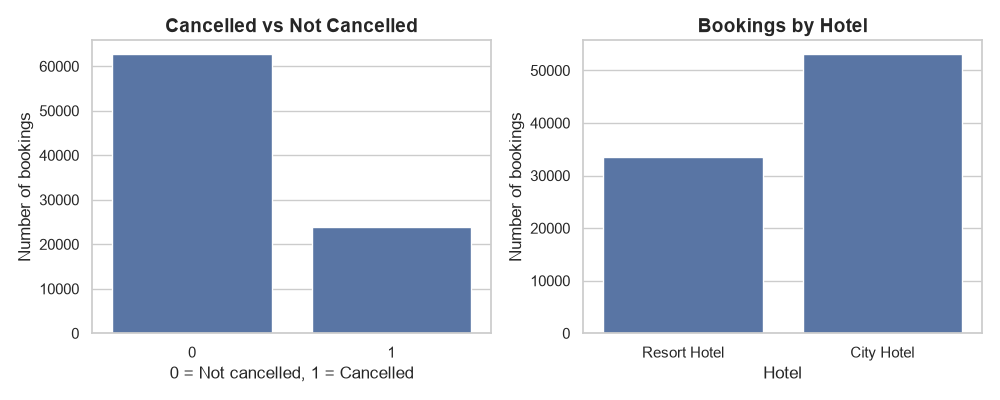
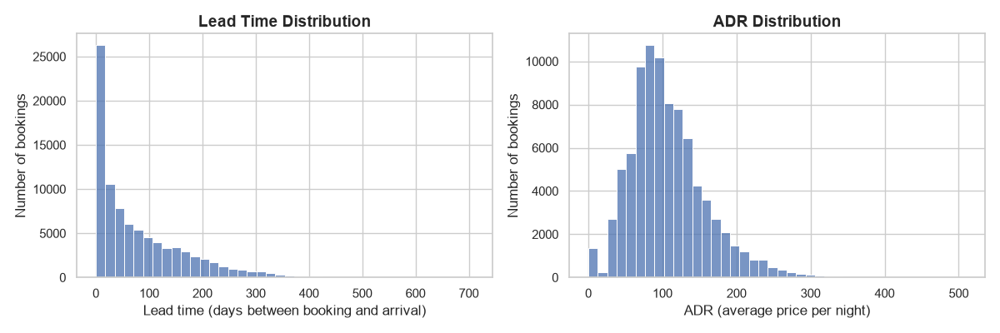
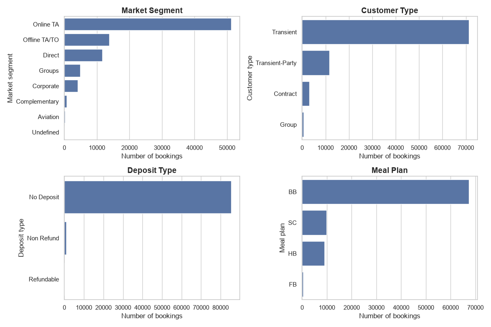
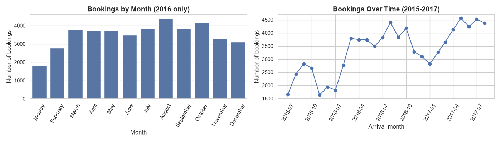
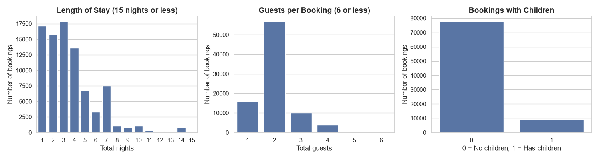
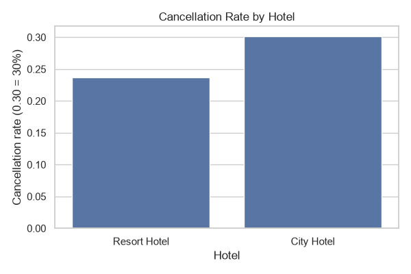
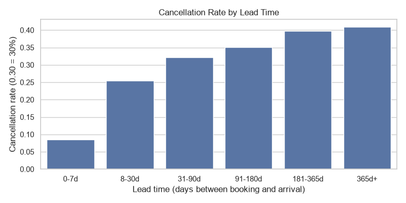
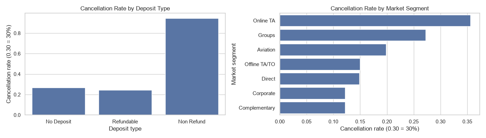
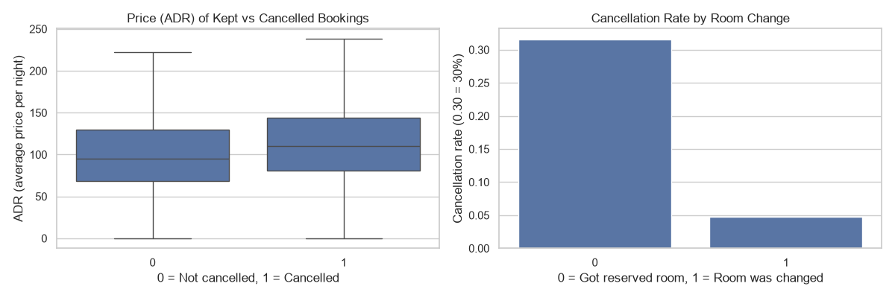
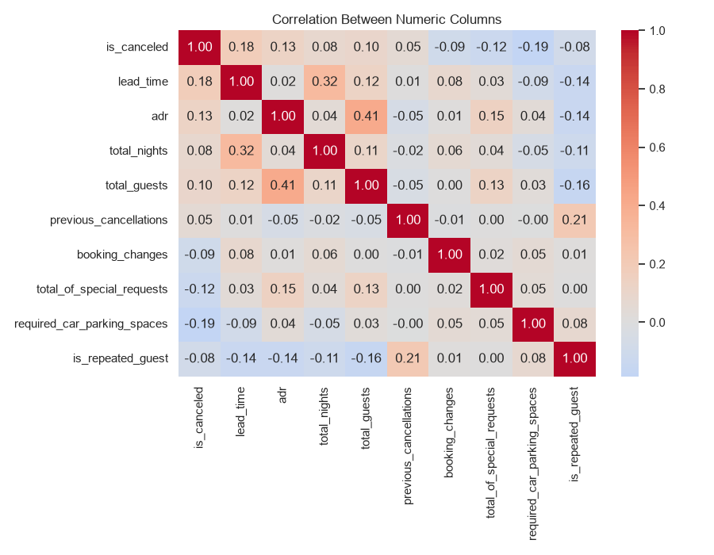

# 🏨 Hotel Booking Analysis: Reducing Cancellations and Protecting Revenue

> An end-to-end data analysis case study on **119,390 hotel bookings** (City Hotel and Resort Hotel, July 2015 – August 2017). It finds **who cancels, when, and how much it costs**, tests five business hypotheses statistically, and ends with ranked recommendations.

   

---

## 📌 Table of Contents
1. [Business Problem](#1-business-problem)
2. [Key Results at a Glance](#2-key-results-at-a-glance)
3. [Dataset](#3-dataset)
4. [Project Structure](#4-project-structure)
5. [How to Run](#5-how-to-run)
6. [Data Cleaning and Preparation](#6-data-cleaning-and-preparation)
7. [Exploratory Data Analysis](#7-exploratory-data-analysis)
8. [Bivariate and Multivariate Analysis](#8-bivariate-and-multivariate-analysis)
9. [Hypothesis Testing](#9-hypothesis-testing)
10. [Business Insights](#10-business-insights)
11. [Recommendations](#11-recommendations)
12. [Limitations](#12-limitations)
13. [Tech Stack](#13-tech-stack)

---

## 1. Business Problem
A cancelled booking is a room that may stay empty, and hotel rooms cannot be stored for later. The management of a City Hotel and a Resort Hotel wants to understand:

- **How often** do guests cancel, and **how much money** is involved?
- **Which guests, channels and booking patterns** are most likely to cancel?
- **Are the two hotels different**, and do they need different policies?
- **What actions** would reduce cancellations and protect revenue?

---

## 2. Key Results at a Glance

| Metric | Result |
|---|---|
| Bookings analysed (after cleaning) | **86,637** |
| Overall cancellation rate | **27.7%** |
| Share of booking *value* in cancelled bookings | **33.3%** (about €11.5M of €34.4M) |
| City Hotel vs Resort Hotel cancellation | **30.2% vs 23.7%** |
| Last-minute (0-7 days) vs very early (180+ days) bookings | **8.5% vs about 40%** cancel |
| Online travel agents (Online TA) | **35.5%** cancel, and **81% of all cancelled value** |
| Direct bookings | 14.9% cancel |

---

## 3. Dataset

| Item | Detail |
|---|---|
| Source | Hotel Booking Demand dataset (Antonio, Almeida and Nunes, 2019) |
| Raw size | 119,390 rows × 32 columns |
| Hotels | City Hotel, Resort Hotel |
| Period | July 2015 – August 2017 |
| Target | `is_canceled` (1 = cancelled, 0 = kept) |
| Main columns | `lead_time`, `adr` (average daily rate), `market_segment`, `deposit_type`, `customer_type`, `stays_in_*_nights`, `adults`, `children`, `babies`, `arrival_date_*` |

---

## 4. Project Structure

```
hotel-booking-analysis/
├── data/
│   ├── raw/                       # original CSV (never edited)
│   └── processed/                 # cleaned dataset
├── notebooks/
│   ├── 01_hotel_analysis.ipynb            # data understanding, cleaning, preparation
│   ├── 02_eda.ipynb                       # exploratory data analysis
│   ├── 03_bivariate_analysis.ipynb        # bivariate / multivariate analysis
│   ├── 04_hypothesis_testing.ipynb        # five hypothesis tests
│   └── 05_insights_and_recommendations.ipynb
├── src/
│   └── 01_clean_data.py           # script version of the cleaning step
├── visuals/                       # all charts exported as PNG
├── reports/
│   └── hypothesis_test_summary.csv
├── requirements.txt
├── .gitignore
└── README.md
```

---

## 5. How to Run

```bash
# 1. install the libraries
pip install -r requirements.txt

# 2. put hotel_bookings.csv in data/raw/

# 3. run the notebooks in order
jupyter notebook notebooks/
```

Run the notebooks in numeric order. Notebook 01 creates `data/processed/hotel_bookings_clean.csv`, which all later notebooks load.

---

## 6. Data Cleaning and Preparation

Every cleaning step was logged so the effect on the data is traceable.

| Problem found | Action | Why |
|---|---|---|
| **31,994 exact duplicate rows** | Removed | They would overweight repeated records and inflate every percentage |
| `children` missing (4 rows in the raw data) | Filled with 0 | Too few to matter, and 0 is the most sensible value |
| `country` missing (488 rows in the raw data) | Filled with "Unknown" | Keeps the rows without inventing a country |
| `agent` and `company` missing (a blank means *no agent / no company*) | Converted to flags `has_agent`, `has_company`, then dropped the raw ID columns | The blank itself carries meaning |
| Meal type "Undefined" | Relabelled as "SC" (no meal package) | Same meaning in the data dictionary |
| **166** bookings with zero guests | Removed | Impossible records |
| **591** bookings with zero nights | Removed | They would distort price and value |
| **2** price outliers (a negative ADR and an ADR of 5,400) | Removed | Clear data errors |

**Result:** 119,390 → **86,637 rows**, 42 columns, 0 missing values. The cancellation rate moved from 37.0% to **27.7%** after cleaning, which shows why cleaning must come before analysis.

**New columns created:** `total_nights`, `total_guests`, `is_family`, `revenue` (ADR × nights), `room_changed`, `arrival_month_num`, `arrival_date`, `arrival_weekday`, `season`, `lead_time_group`.

> **Data-leakage note:** `reservation_status` and `room_changed` are recorded *after* a booking is cancelled or completed, so they are not used as predictors of cancellation.

---

## 7. Exploratory Data Analysis

**Cancellations and hotels:** about 1 in 4 bookings is cancelled, and the City Hotel makes up 61% of bookings.



**Lead time and price:** lead time is strongly right-skewed (median 50 days, mean 80), and about 21% of bookings are made within a week of arrival. Prices cluster around €100 a night.



**Who books and how:** 59% of bookings come through online travel agents, 82% of guests are individual "transient" travellers, and 98.7% of bookings required no deposit.



**Seasonality:** August is the busiest month and January the quietest (about 2.4× difference). Only 2016 is used for the month chart because it is the only year with all 12 months. Using all years would make July and August look busier simply because they appear three times in the data.



**Stay length and guests:** the typical stay is 3 nights, 94% of stays are a week or less, couples dominate (65% of bookings have 2 guests), and only 10.5% of bookings include children.



---

## 8. Bivariate and Multivariate Analysis

The question in this step is always: **does the cancellation rate change between groups?**

**City Hotel cancels more than the Resort.**



**The longer ahead a guest books, the more likely they are to cancel.** The rate climbs from 8.5% (0-7 days) to 41.0% (365+ days).



**Deposit type and channel.** Online TA cancels at 35.5%, about three times the rate of Direct (14.9%) or Corporate (12.2%). Non-refundable bookings cancel 94.7% of the time, a surprising result discussed in the limitations.



**Price and room changes.** Cancelled bookings have a higher median price (€109.8 vs €95.0). The room-change pattern (4.8% vs 31.6% cancellation) is a **reverse-causality trap**: a room is only reassigned when a guest actually arrives, so cancelled bookings can never show a change.



**Correlations.** No single numeric column is a strong predictor (the largest value is 0.19), so cancellation depends on a combination of factors. Lead time (+0.18) and parking requirement (-0.19) are the strongest.



---

## 9. Hypothesis Testing

All tests were chosen using a decision tree (data type → number of samples → test). The significance level is **α = 0.05**, and every test also reports an **effect size**, because with 86,637 rows even small differences become statistically significant.

| # | Hypothesis | Test | Statistic | p-value | Effect | Decision |
|---|---|---|---|---|---|---|
| H1 | The two hotels have different cancellation rates | 2 proportion test | Z = 20.8 | < 0.001 | City 30.2% vs Resort 23.7% | Reject H0 |
| H2 | Cancelled bookings have a longer average lead time | 2 sample t test | t = 52.2 | < 0.001 | 105.8 vs 70.5 days | Reject H0 |
| H3 | Online TA cancels more than other channels | 2 proportion test (one-sided) | Z = 62.3 | < 0.001 | 35.5% vs 16.3% | Reject H0 |
| H4 | Deposit type is related to cancellation | Degree of association (chi-square) | χ² = 2354.6 | < 0.001 | Non Refund 94.7% vs No Deposit 26.9% | Reject H0 |
| H5 | Average price differs across seasons | One-way ANOVA | F = 7436.2 | < 0.001 | Summer €138.1 vs Winter €76.5 | Reject H0 |

**How to read this:** for each test, H0 (the null hypothesis) says "nothing is going on". The test statistic measures how far our data is from that "nothing" world, and the p-value is the chance of seeing a result this extreme if H0 were true. A p-value below 0.05 means luck is an unlikely explanation, so H0 is rejected.

Full table: [`reports/hypothesis_test_summary.csv`](reports/hypothesis_test_summary.csv)

---

## 10. Business Insights

1. **Cancellations cost more than their share suggests.** 27.7% of bookings are cancelled, but they hold **33.3% of booking value** (about €11.5M), because cancelled bookings tend to be pricier.
2. **Online travel agents are the biggest lever.** They bring 59% of bookings but **81% of the cancelled value** (about €9.3M).
3. **Booking far ahead is risky.** Cancellation rises steadily with lead time, from 8.5% to about 40%.
4. **The two hotels behave differently.** The City Hotel cancels more (30.2% vs 23.7%) and holds more cancelled value (€6.6M vs €4.9M).
5. **Engaged guests cancel less.** Guests with no special requests cancel 33.5% of the time, versus 16.2% for guests with three or more.
6. **Demand and price are seasonal.** August and October are peaks, while November to January is weak. Average price is €138 in summer and €77 in winter, and season explains about 20% of price variation.
7. **Stricter deposits did not reduce cancellations in this data.** Non-refundable bookings cancelled 94.7% of the time (see limitations).

### What-if scenario
If the cancellation rate fell by **5 percentage points** in each group (an assumption, not a forecast):

| Group | Bookings saved | Value saved | Share of all lost value |
|---|---|---|---|
| Online TA bookings | about 2,564 | about €1.31M | 11.4% |
| Booked more than 90 days ahead | about 1,496 | about €0.81M | 7.1% |
| City Hotel bookings | about 2,652 | about €1.09M | 9.5% |

> The groups overlap (35% of Online TA bookings are also more than 90 days ahead), so these figures must **not** be added together.

---

## 11. Recommendations

| Priority | Recommendation | Evidence |
|---|---|---|
| **1** | **Target Online TA bookings first:** negotiate stricter cancellation terms on early bookings and add incentives to book direct | H3; 81% of cancelled value; Direct cancels only 14.9% |
| **2** | **Add rules for early bookings:** reminders, re-confirmation requests and a shorter free-cancellation window | H2; cancellation rises from 8.5% to about 40% with lead time |
| **3** | **Flag high-risk bookings for early contact** (no special requests, previous cancellations) | 33.5% vs 16.2% cancellation by special requests; 76.4% with one earlier cancellation |
| **4** | **Use separate policies for each hotel:** tighter rules at the City Hotel, protect what works at the Resort | H1; €6.6M vs €4.9M cancelled value |
| **5** | **Investigate before relying on stricter deposits:** check how non-refundable bookings are made and charged, then pilot | H4; 94.7% cancellation among Non Refund bookings |
| **6** | **Match pricing and terms to the season:** winter offers for weak months, firmer terms in peak season | H5; €138 summer vs €77 winter ADR |

**Track every month, by hotel and channel:** cancellation rate, value of cancelled bookings, and the share of bookings from Online TA vs Direct.

---

## 12. Limitations

- **Association, not causation.** The tests show that differences are real, not what causes them. The Non Refund result is the clearest example: it does not prove deposits cause cancellations.
- **"Value" is potential revenue.** It is ADR × nights. Cancelled rooms may be resold, and refunds or cancellation fees are not in the data.
- **What-if numbers are scenarios.** The 5-point reduction is an assumption, and groups overlap.
- **Duplicates.** The dataset has no booking ID, so some of the 31,994 removed rows may have been genuine identical bookings. Removing them is standard practice for this dataset, but it is a judgement call.
- **Time span.** The data covers about 26 months, and only 2016 has all 12 months.
- **Leakage columns** (`reservation_status`, `room_changed`) were deliberately not used to explain cancellations.

---

## 13. Tech Stack
Python · pandas · NumPy · Matplotlib · Seaborn · SciPy · statsmodels · Jupyter

---

## 👤 Author
**Your Name** · [LinkedIn](www.linkedin.com/in/prajwal-wankhede-22388628a) · [GitHub](https://github.com/prajwal-sv)

*Dataset: Antonio, N., de Almeida, A., and Nunes, L. (2019). Hotel booking demand datasets. Data in Brief, 22, 41-49.*
